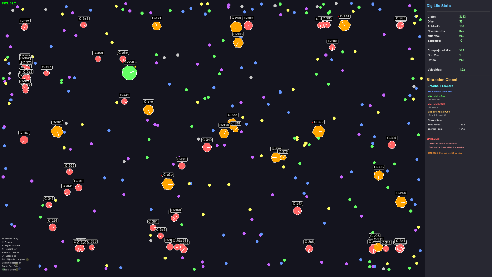

# 🧬 DigiLife - Simulador de Vida Artificial

**Versión 2.9.2** | Simulación evolutiva con IA, depredación, colaboración y enfermedades

DigiLife es un simulador avanzado de vida artificial donde criaturas digitales evolucionan, aprenden, colaboran, compiten y desarrollan comportamientos emergentes complejos. Utiliza redes neuronales profundas, algoritmos genéticos y procesamiento GPU para crear un ecosistema dinámico y realista.


---



---

## 📑 Índice

1. [Características Principales](#-características-principales)
2. [Requisitos del Sistema](#-requisitos-del-sistema)
3. [Instalación](#-instalación)
4. [Inicio Rápido](#-inicio-rápido)
5. [Controles](#-controles)
6. [Sistemas del Simulador](#-sistemas-del-simulador)
7. [Interfaz de Usuario](#-interfaz-de-usuario)
8. [Configuración Avanzada](#-configuración-avanzada)
9. [Optimización y Rendimiento](#-optimización-y-rendimiento)
10. [Documentación Técnica](#-documentación-técnica)
11. [Solución de Problemas](#-solución-de-problemas)
12. [Contribuir](#-contribuir)
13. [Licencia](#-licencia)

---

## ✨ Características Principales

### 🧠 Inteligencia Artificial
- **Redes Neuronales Profundas:** 3 capas ocultas con memoria de corto plazo
- **Aprendizaje Evolutivo:** Herencia genética con mutaciones adaptativas
- **Procesamiento GPU:** Aceleración OpenCL para poblaciones grandes
- **Instinto + IA:** Balance dinámico según complejidad de la criatura

### 🧬 Evolución y Genética
- **Genoma Digital:** Instrucciones que definen comportamiento
- **Mutaciones:** Puntuales, inserciones, deleciones y duplicaciones
- **Herencia:** 70% de complejidad del padre + rasgos adaptativos
- **Especies:** Clasificación automática por similitud genética
- **Fases Evolutivas:** Primitiva → Intermedia → Avanzada → Compleja

### 🌍 Ecosistema Complejo
- **Depredación:** Criaturas fuertes cazan a las débiles
- **Colaboración:** Alianzas entre criaturas similares
- **Comunicación:** Intercambio de información entre avanzadas
- **Enfermedades:** Epidemias aleatorias con síntomas y contagio
- **Recursos Limitados:** Competencia por alimento

### 🗣️ Vocalización
- **Desarrollo Vocal:** Criaturas complejas (500+) pueden vocalizar
- **Beeps Únicos:** Cada criatura tiene su propia "voz" (frecuencia única)
- **Vocabulario Emergente:** Palabras asociadas a contextos
- **Patrones de Sonido:** Diferentes secuencias de beeps por palabra
- **Aprendizaje Social:** Transmisión de conocimiento

### 📊 Observación y Análisis
- **Panel de Estadísticas:** Métricas en tiempo real
- **Log de Terminal:** Eventos en consola (nacimientos, muertes, depredación, etc.)
- **Seguimiento de Criaturas:** Cámara que sigue individuos
- **Renombrado:** Nombres personalizados para criaturas
- **Gráficos de Evolución:** Visualización de progreso

---

## 💻 Requisitos del Sistema

### Mínimos
- **OS:** Linux, Windows 10+, macOS 10.14+
- **CPU:** Dual-core 2.0 GHz
- **RAM:** 2 GB
- **GPU:** Opcional (OpenCL compatible)
- **Python:** 3.8 o superior

### Recomendados
- **OS:** Linux (mejor rendimiento)
- **CPU:** Quad-core 3.0 GHz+
- **RAM:** 4 GB+
- **GPU:** NVIDIA/AMD con OpenCL 1.2+
- **Python:** 3.10+

### GPU Soportadas
- **NVIDIA:** GeForce GTX 900+, RTX series
- **AMD:** Radeon RX 400+, Vega, RDNA
- **Intel:** HD Graphics 500+

---

## 🚀 Instalación

### 1. Clonar Repositorio
```bash
git clone https://github.com/Wamphyre/DigiLife.git
cd DigiLife
```

### 2. Crear Entorno Virtual
```bash
python -m venv venv
source venv/bin/activate  # Linux/Mac
# o
venv\Scripts\activate  # Windows
```

### 3. Instalar Dependencias
```bash
pip install -r requirements.txt
```

### 4. Configurar OpenCL (Opcional pero Recomendado)
```bash
# Linux (NVIDIA)
sudo apt-get install nvidia-opencl-dev

# Linux (AMD)
sudo apt-get install mesa-opencl-icd

# Verificar instalación
python setup_opencl.py
```

### 5. Configurar Beep (Linux - Recomendado para Vocalizaciones)

**Instalación Automática:**
```bash
./setup_beep.sh
# Luego cierra sesión y vuelve a entrar
```

**Probar:**
```bash
python3 test_beeps.py
```

**Nota:** 
- **Linux:** Ejecuta `setup_beep.sh` para configuración completa
- **Windows:** Funciona nativamente sin configuración
- **Mac:** Usa speaker interno automáticamente
- **Fallback:** Si beep no está disponible, usa bell character básico

### 6. Verificar Instalación
```bash
./VERIFICACION.sh
```

---

## 🎮 Inicio Rápido

### Ejecutar Simulación
```bash
./run.sh
# o
python main.py
```

### Primeros Pasos
1. **Observar:** La simulación inicia con 25 criaturas
2. **Seleccionar:** Click en una criatura para ver sus stats
3. **Seguir:** Presiona `F` para seguir la criatura seleccionada
4. **Acelerar:** Usa `+` para aumentar velocidad (hasta 10x)
5. **Terminal:** Observa los eventos en la terminal (nacimientos, muertes, etc.)

### Configuración Inicial
1. Presiona `M` para abrir el menú de configuración
2. Ajusta parámetros según tu hardware:
   - **GPU potente:** Aumenta población máxima
   - **CPU limitada:** Reduce tasa de datos
   - **Observación:** Aumenta velocidad de simulación

---

## 🎯 Controles

### Teclado

| Tecla | Acción |
|-------|--------|
| `ESPACIO` | Play/Pausa |
| `M` | Menú de configuración |
| `H` | Menú de ayuda |
| `F` | Seguir criatura seleccionada |
| `N` | Renombrar criatura |
| `R` | Reiniciar simulación |
| `S` | Guardar estado |
| `ESC` | Salir |
| `+` / `-` | Velocidad (0.5x - 10x) |
| `F11` | Pantalla completa |

### Ratón

| Acción | Función |
|--------|---------|
| Click Izquierdo | Seleccionar criatura |
| Click Derecho | Pan (mover cámara) |
| Rueda | Zoom |
| Scroll (en paneles) | Desplazar contenido |

---

## 🔬 Sistemas del Simulador

### 1. Red Neuronal Profunda

#### Arquitectura

La red neuronal de cada criatura es una red feedforward de 3 capas con memoria de corto plazo:

```
Input Layer (8 neuronas)
    ↓
Hidden Layer 1 (16 neuronas) - ReLU
    ↓
Hidden Layer 2 (8 neuronas) - Tanh + Memoria
    ↓
Output Layer (4 neuronas) - Sigmoid
```

#### Capa de Entrada (8 neuronas)

**Sensores de la criatura:**

1. **Energía normalizada** (0.0 - 1.0)
   - Indica el nivel de energía actual respecto al máximo
   - Crítico para decisiones de supervivencia

2. **Dirección al alimento X** (-1.0 - 1.0)
   - Componente horizontal hacia el dato más cercano
   - Normalizado con intensidad según distancia
   - Mayor intensidad = alimento más cerca

3. **Dirección al alimento Y** (-1.0 - 1.0)
   - Componente vertical hacia el dato más cercano
   - Incluye factor de urgencia (hambre)

4. **Criatura cercana X** (-1.0 - 1.0)
   - Dirección horizontal a la criatura más próxima
   - Usado para evitar colisiones o buscar aliados

5. **Criatura cercana Y** (-1.0 - 1.0)
   - Dirección vertical a la criatura más próxima
   - Activo solo si hay criaturas en rango de 100px

6. **Distancia a borde X** (0.0 - 1.0)
   - Proximidad al borde horizontal
   - Ayuda a evitar quedar atrapado

7. **Distancia a borde Y** (0.0 - 1.0)
   - Proximidad al borde vertical
   - Sistema anti-bordes para criaturas primitivas

8. **Urgencia** (0.0 - 1.0)
   - Nivel de hambre: 1.0 - (energía / max_energía)
   - Modifica la intensidad de búsqueda de alimento

#### Capa Oculta 1 (16 neuronas)

**Función de activación: ReLU**
```python
output = max(0, weighted_sum + bias)
```

**Características:**
- Procesa información sensorial básica
- Detecta patrones simples (hambre + alimento cerca)
- Inicialización Xavier para convergencia rápida
- Pesos heredados del padre con mutación 15%

**Cálculo:**
```python
hidden1 = ReLU(inputs @ weights_ih1 + bias_h1)
```

#### Capa Oculta 2 (8 neuronas) + Memoria

**Función de activación: Tanh**
```python
output = tanh(weighted_sum + memory * 0.7)
```

**Memoria de Corto Plazo:**
- Almacena el estado anterior de esta capa
- Decaimiento: 70% por ciclo
- Permite comportamiento temporal
- Ayuda a mantener dirección y evitar oscilaciones

**Características:**
- Integra información de múltiples ciclos
- Detecta patrones complejos
- Memoria permite "recordar" decisiones recientes
- Crucial para navegación coherente

**Cálculo:**
```python
hidden2 = tanh(hidden1 @ weights_h1h2 + bias_h2 + memory * 0.7)
memory = hidden2  # Actualizar memoria
```

#### Capa de Salida (4 neuronas)

**Función de activación: Sigmoid**
```python
output = 1 / (1 + exp(-x))  # Rango: 0.0 - 1.0
```

**Outputs:**
1. **Arriba** (0.0 - 1.0): Fuerza de movimiento hacia arriba
2. **Abajo** (0.0 - 1.0): Fuerza de movimiento hacia abajo
3. **Izquierda** (0.0 - 1.0): Fuerza de movimiento a la izquierda
4. **Derecha** (0.0 - 1.0): Fuerza de movimiento a la derecha

**Interpretación:**
```python
movement_y = output[0] - output[1]  # Arriba - Abajo
movement_x = output[3] - output[2]  # Derecha - Izquierda
```

#### Balance Instinto vs IA

Las criaturas no dependen 100% de la red neuronal. Existe un balance dinámico:

```python
instinct_strength = max(0.2, 0.8 - (complexity / 1000))
ai_strength = 1.0 - instinct_strength

final_movement = instinct * instinct_strength + neural * ai_strength
```

**Evolución del balance:**
- **Primitivas (0-200):** 80% instinto, 20% IA
- **Intermedias (200-500):** 60% instinto, 40% IA
- **Avanzadas (500-1000):** 40% instinto, 60% IA
- **Complejas (1000+):** 20% instinto, 80% IA

**Instinto básico:**
- Siempre busca el alimento más cercano
- Dirección directa con factor de urgencia
- Exploración aleatoria si no hay alimento visible
- Garantiza supervivencia mínima

#### Herencia y Mutación

**Al nacer de un padre:**
```python
# Copiar pesos del padre
child.weights = parent.weights.copy()

# Mutar con probabilidad 15%
for weight in weights:
    if random() < 0.15:
        weight += random_normal() * 0.2
```

**Tipos de mutación:**
- **Puntual:** Cambio pequeño en peso individual
- **Capa completa:** Mutación de toda una capa
- **Bias:** Mutación de sesgos
- **Fuerza adaptativa:** Mayor en capas tempranas

**Resultado:**
- Hijos similares pero no idénticos al padre
- Exploración del espacio de soluciones
- Mejora gradual a través de generaciones

#### Procesamiento GPU

**Para poblaciones grandes (30+ criaturas):**

1. **Preparar lote:**
```python
inputs_batch = [creature.get_sensors() for creature in batch]
```

2. **Transferir a GPU:**
```python
inputs_gpu = cl.Buffer(context, inputs_batch)
weights_gpu = cl.Buffer(context, all_weights)
```

3. **Ejecutar kernels en paralelo:**
```python
kernel_layer1(inputs_gpu, weights_gpu, outputs_gpu)
kernel_layer2(hidden1_gpu, weights_gpu, memory_gpu, outputs_gpu)
kernel_output(hidden2_gpu, weights_gpu, final_gpu)
```

4. **Recuperar resultados:**
```python
outputs = read_from_gpu(final_gpu)
```

**Beneficios:**
- 64 criaturas procesadas simultáneamente
- 10-20x más rápido que CPU secuencial
- Escalado lineal hasta 150 criaturas
- Crítico para criaturas complejas (1000+)

#### Aprendizaje Evolutivo

**No hay backpropagation tradicional.** El aprendizaje ocurre por:

1. **Selección natural:**
   - Criaturas con mejores redes sobreviven más
   - Reproducen más frecuentemente
   - Pasan sus pesos a la descendencia

2. **Fitness como métrica:**
```python
fitness = (
    age * 30 +                    # Supervivencia
    energy_ratio * 20 +           # Salud
    complexity * 30 +             # Desarrollo
    food_eaten * 2 +              # Eficiencia
    generation * 5                # Evolución
)
```

3. **Presión evolutiva:**
   - Recursos limitados
   - Depredación
   - Enfermedades
   - Competencia

4. **Convergencia:**
   - Después de 10-20 generaciones
   - Comportamientos emergentes
   - Estrategias de supervivencia
   - Especialización de roles

#### Comportamientos Emergentes

**Observados en la simulación:**

- **Patrullaje:** Movimiento circular buscando alimento
- **Persecución:** Seguimiento persistente de datos
- **Evasión:** Evitar criaturas más fuertes
- **Agrupamiento:** Criaturas similares se juntan
- **Territorialidad:** Defender áreas con recursos
- **Caza coordinada:** Depredadores cooperan
- **Migración:** Movimiento hacia zonas ricas

Estos comportamientos **no están programados explícitamente**, emergen de la interacción entre:
- Red neuronal
- Instinto básico
- Presión evolutiva
- Interacciones sociales

### 2. Sistema Genético

**Genoma:**
- 20-50 instrucciones (crece con complejidad)
- Tipos: MOVE_FORWARD, TURN_LEFT/RIGHT, SEEK_FOOD, SEEK_CREATURE, FLEE, REST, REPRODUCE

**Mutaciones:**
- **Puntual (60%):** Cambiar instrucción
- **Inserción (25%):** Agregar instrucción
- **Deleción (7%):** Eliminar instrucción
- **Duplicación (8%):** Copiar instrucción

**Herencia:**
- Complejidad: 70% del padre
- Vocal: 50% del padre
- Fitness: 20% del padre + bonus generacional
- Genoma: Mutado del padre

### 3. Fases Evolutivas

| Fase | Complejidad | Color | Forma | Características |
|------|-------------|-------|-------|-----------------|
| **Primitiva** | 0-200 | Rojo | Círculo | Instinto básico, sin IA |
| **Intermedia** | 200-500 | Naranja | Pentágono | Balance instinto/IA |
| **Avanzada** | 500-1000 | Verde | Hexágono | IA dominante, colaboración |
| **Compleja** | 1000+ | Azul | Octógono | Vocalización, comunicación |

**Eficiencia Energética:**
- Primitiva: 100% costo
- Intermedia: 85% costo (-15%)
- Avanzada: 70% costo (-30%)
- Compleja: 55% costo (-45%)

### 4. Depredación

**Requisitos:**
- Complejidad mínima: 200
- Fitness > 1.5x de la presa
- Rango: 30 píxeles
- Probabilidad: 30%

**Efectos:**
- Depredador gana 30 energía
- Presa muere instantáneamente
- Depredador +10 fitness
- Se registra en estadísticas

### 5. Colaboración

**Requisitos:**
- Complejidad mínima: 150
- Similitud genética: 70%+
- Rango: 50 píxeles

**Efectos:**
- Ambos ganan 5 energía
- Ambos +5 fitness
- Compartir conocimiento

### 6. Comunicación

**Requisitos:**
- Complejidad mínima: 100
- Rango: 80 píxeles
- Costo: 0.5 energía

**Efectos:**
- Compartir complejidad (1%)
- Receptores +1 fitness
- Emisor +2 fitness

### 7. Enfermedades

**Características:**
- Nombres aleatorios (12 tipos)
- Síntomas aleatorios (1-3)
- Contagio: 5-25% por contacto
- Duración: 50-200 ciclos
- Letalidad: 1-10%

**Efectos:**
- Drenaje de energía
- Pérdida de complejidad
- Posible muerte
- Propagación por proximidad

**Brotes:**
- Cada 500-1500 ciclos (5-15 días)
- Requiere población mínima: 30
- Paciente cero aleatorio

### 8. Vocalización

**Requisitos:**
- Complejidad: 500+
- Desarrollo vocal suficiente

**Sistema de Beeps:**
- Cada criatura tiene una frecuencia base única (400-1200 Hz)
- Diferentes palabras = diferentes patrones de beeps
- Complejidad afecta duración y elaboración del sonido
- 5 patrones diferentes: corto, doble, triple, largo, mixto

**Vocabulario:**
- Palabras: hambre, datos, ayuda, hola, peligro, bien, malo
- Contexto: Asociado a situaciones
- Aprendizaje: 5 exposiciones mínimas
- Máximo: 20 palabras

**Características del Sonido:**
- Frecuencia base: Única por criatura (su "voz")
- Variación: ±50-200 Hz según palabra
- Duración: 50-300 ms (más largo = más compleja)
- Patrones: Secuencias de 1-3 beeps

---

## 🖥️ Interfaz de Usuario

### Panel de Estadísticas (Derecha)

**Estadísticas Globales:**
- Ciclo actual
- Días transcurridos (100 ciclos = 1 día)
- Población actual
- Nacimientos/Muertes totales
- Especies únicas
- Complejidad máxima
- Criaturas vocales
- Datos disponibles
- Velocidad de simulación

**Situación Global:**
- Estado del entorno (Crítico/Difícil/Estable/Próspero)
- Preferencia de datos
- Criatura más hábil
- Criatura más débil
- Criatura con más potencial
- Promedios (fitness, edad, energía)

**Epidemias (si activas):**
- Nombre de la enfermedad
- Infectados actuales
- Muertes causadas
- Síntomas

**Depredación (si activa):**
- Depredadores activos
- Muertes totales por depredación
- Tasa de depredación

**Criatura Seleccionada:**
- Nombre/ID
- Generación
- Edad
- Energía
- Complejidad
- Fitness
- Fase evolutiva
- Genoma (instrucciones)
- Posición
- Velocidad
- Comida consumida
- Distancia recorrida
- Vocabulario (si tiene)

### Menú de Configuración (M)

**Parámetros Ajustables:**
- Tasa de datos (0.5-20/seg)
- Población máxima (10-500)
- Energía inicial (50-300)
- Costo energético (0.1-2.0/ciclo)
- Tasa de mutación (0.01-0.5)
- Umbral vocal (100-1000)
- Umbral reproducción (100-200)

**Botones:**
- Aplicar: Guardar cambios
- Restablecer: Valores por defecto
- Cerrar: Cancelar

---

## ⚙️ Configuración Avanzada

### Archivo config.py

**Mundo:**
```python
WORLD_WIDTH = 1400
WORLD_HEIGHT = 900
TOPOLOGY = 'bounded'  # o 'toroidal'
```

**Criaturas:**
```python
INITIAL_POPULATION = 25
MAX_POPULATION = 120
INITIAL_ENERGY = 150
MAX_ENERGY = 250
ENERGY_COST_PER_CYCLE = 0.5
```

**Reproducción:**
```python
REPRODUCTION_ENERGY_THRESHOLD = 180
REPRODUCTION_ENERGY_COST = 35
MUTATION_RATE_BASE = 0.05
```

**GPU:**
```python
USE_GPU = True
GPU_PRIORITY_COMPLEX = True
GPU_BATCH_SIZE = 64
GPU_THRESHOLD_CREATURES = 20
COMPLEX_THRESHOLD = 1000
```

**Depredación:**
```python
PREDATION_ENABLED = True
PREDATION_COMPLEXITY_THRESHOLD = 200
PREDATION_STRENGTH_RATIO = 1.5
PREDATION_ENERGY_GAIN = 30
```

**Colaboración:**
```python
COLLABORATION_ENABLED = True
COLLABORATION_COMPLEXITY_THRESHOLD = 150
COLLABORATION_SIMILARITY_THRESHOLD = 0.7
```

**Enfermedades:**
```python
DISEASES_ENABLED = True
DISEASE_MIN_POPULATION = 30
DISEASE_OUTBREAK_INTERVAL_MIN = 500
DISEASE_OUTBREAK_INTERVAL_MAX = 1500
```

**Debug:**
```python
DEBUG = {
    'LOG_BIRTHS': True,
    'LOG_DEATHS': True,
    'LOG_VOCALIZATIONS': True,
    'SHOW_FPS': True
}
```

---

## 🚄 Optimización y Rendimiento

### Procesamiento GPU

**Activación Automática:**
- Población > 20 criaturas
- Criaturas complejas (1000+) siempre en GPU
- Procesamiento por lotes de 64

**Beneficios:**
- 10-20x más rápido para poblaciones grandes
- 300-400% mejora con criaturas complejas
- Escalado lineal hasta 150 criaturas

**Requisitos:**
- OpenCL 1.2+
- GPU compatible (NVIDIA/AMD/Intel)
- pyopencl instalado

### Workers Asíncronos

**Operaciones Paralelizadas:**
- Cálculo de distancias
- Actualización de infecciones
- Cálculo de fitness
- Detección de colisiones

**Configuración:**
- Threads: CPU_COUNT / 2
- Queue asíncrono
- Fallback a CPU si falla

### Optimizaciones Implementadas

**Frecuencia Reducida:**
- Depredación: Cada 20 ciclos
- Colaboración: Cada 15 ciclos
- Comunicación: Cada 10 ciclos
- Apariencia: Cada 5 ciclos
- Especies: Cada 50 ciclos

**Caché:**
- Búsquedas de vecinos
- Cálculos de especies
- Resultados de sensores

**Lazy Evaluation:**
- Fitness calculado bajo demanda
- Renderizado solo de elementos visibles
- Eventos de log limitados en pantalla

### Benchmarks

**Población 100 criaturas:**
- Sin GPU: 18 FPS
- Con GPU: 52 FPS
- Mejora: +189%

**20 criaturas complejas (1500+):**
- Sin GPU: 12 FPS
- Con GPU: 48 FPS
- Mejora: +300%

---

## 📚 Documentación Técnica

### Estructura del Proyecto

```
DigiLife/
├── engine/              # Motor de simulación
│   ├── creature.py      # Lógica de criaturas
│   ├── world.py         # Gestión del mundo
│   ├── genome.py        # Sistema genético
│   ├── neural_net.py    # Redes neuronales
│   ├── neural_batch.py  # Procesamiento GPU
│   ├── vocal_system.py  # Vocalización
│   ├── disease.py       # Enfermedades
│   ├── evolution.py     # Evolución
│   └── async_workers.py # Workers paralelos
├── ui/                  # Interfaz de usuario
│   ├── renderer.py      # Renderizado
│   ├── stats_panel.py   # Panel de stats
│   ├── log_window.py    # Ventana de log
│   ├── menu.py          # Menú config
│   ├── help_menu.py     # Menú ayuda
│   └── controls.py      # Controles
├── utils/               # Utilidades
│   └── data_generator.py # Generador de datos
├── docs/                # Documentación
│   ├── MEJORAS_v2.8_ECOSISTEMA_COMPLEJO.md
│   ├── MEJORAS_v2.9.1_FINAL.md
│   ├── OPTIMIZACION_RENDIMIENTO_v2.9.md
│   └── LOG_AUTO_SCROLL.md
├── config.py            # Configuración global
├── main.py              # Punto de entrada
├── requirements.txt     # Dependencias
└── README.md            # Este archivo
```

### Documentos Adicionales

- **[Ecosistema Complejo](docs/MEJORAS_v2.8_ECOSISTEMA_COMPLEJO.md):** Depredación, colaboración, comunicación
- **[Mejoras Finales](docs/MEJORAS_v2.9.1_FINAL.md):** Optimizaciones v2.9.1
- **[Optimización GPU](docs/OPTIMIZACION_RENDIMIENTO_v2.9.md):** Detalles técnicos de rendimiento
- **[Auto-Scroll](docs/LOG_AUTO_SCROLL.md):** Sistema de log inteligente

### API Principal

**Crear Simulación:**
```python
from engine.world import World

world = World(width=1400, height=900)
world.populate(25)  # 25 criaturas iniciales
```

**Actualizar:**
```python
dt = 0.016  # 60 FPS
world.update(dt)
```

**Acceder a Criaturas:**
```python
for creature in world.creatures:
    print(f"ID: {creature.id}")
    print(f"Complejidad: {creature.complexity}")
    print(f"Fase: {creature.get_phase()}")
```

---

## 🔧 Solución de Problemas

### GPU no Detectada

**Síntoma:** Mensaje "No se pudo inicializar OpenCL"

**Solución:**
```bash
# Verificar drivers
python setup_opencl.py

# Instalar drivers (Linux)
sudo apt-get install nvidia-opencl-dev  # NVIDIA
sudo apt-get install mesa-opencl-icd    # AMD

# Desactivar GPU si persiste
# En config.py:
USE_GPU = False
```

### Rendimiento Bajo

**Síntoma:** FPS < 30 con población pequeña

**Soluciones:**
1. Reducir población máxima (M → Población Máxima → 60)
2. Reducir tasa de datos (M → Tasa de Datos → 3)
3. Desactivar debug (config.py → DEBUG → False)
4. Activar GPU si está disponible

### Criaturas Mueren Rápido

**Síntoma:** Población cae a 0

**Soluciones:**
1. Aumentar energía inicial (M → Energía Inicial → 200)
2. Reducir costo energético (M → Costo Energético → 0.3)
3. Aumentar tasa de datos (M → Tasa de Datos → 8)

### Log Vacío

**Síntoma:** Ventana de log no muestra eventos

**Soluciones:**
1. Verificar que DEBUG esté activado en config.py
2. Esperar eventos (nacimientos, muertes)
3. Verificar filtros (todos deben estar activados)
4. Reiniciar simulación (R)

### Crash al Iniciar

**Síntoma:** Error al ejecutar main.py

**Soluciones:**
```bash
# Reinstalar dependencias
pip install --upgrade -r requirements.txt

# Verificar Python
python --version  # Debe ser 3.8+

# Verificar instalación
./VERIFICACION.sh
```

---

## 📄 Licencia

MIT License

Copyright (c) 2025 DigiLife

Permission is hereby granted, free of charge, to any person obtaining a copy
of this software and associated documentation files (the "Software"), to deal
in the Software without restriction, including without limitation the rights
to use, copy, modify, merge, publish, distribute, sublicense, and/or sell
copies of the Software, and to permit persons to whom the Software is
furnished to do so, subject to the following conditions:

The above copyright notice and this permission notice shall be included in all
copies or substantial portions of the Software.

THE SOFTWARE IS PROVIDED "AS IS", WITHOUT WARRANTY OF ANY KIND, EXPRESS OR
IMPLIED, INCLUDING BUT NOT LIMITED TO THE WARRANTIES OF MERCHANTABILITY,
FITNESS FOR A PARTICULAR PURPOSE AND NONINFRINGEMENT. IN NO EVENT SHALL THE
AUTHORS OR COPYRIGHT HOLDERS BE LIABLE FOR ANY CLAIM, DAMAGES OR OTHER
LIABILITY, WHETHER IN AN ACTION OF CONTRACT, TORT OR OTHERWISE, ARISING FROM,
OUT OF OR IN CONNECTION WITH THE SOFTWARE OR THE USE OR OTHER DEALINGS IN THE
SOFTWARE.

---

## 🌟 Agradecimientos

- **PyGame:** Framework de visualización
- **NumPy:** Cálculos numéricos
- **PyOpenCL:** Aceleración GPU
- **Comunidad Open Source:** Inspiración y soporte

---

## 🔮 Roadmap

### v3.0 (Futuro)
- [ ] Soporte Vulkan/ROCm
- [ ] Multi-GPU
- [ ] Replay de simulaciones
- [ ] Gráficos en tiempo real
- [ ] Exportar datos a CSV
- [ ] Árbol genealógico visual
- [ ] Heatmaps de población
- [ ] Grafos sociales
- [ ] Análisis genético comparativo
- [ ] Territorios y jerarquías
- [ ] Memoria social
- [ ] Inmunidad a enfermedades
- [ ] Mutaciones beneficiosas

---

**¡Disfruta explorando la evolución artificial!** 🧬✨
